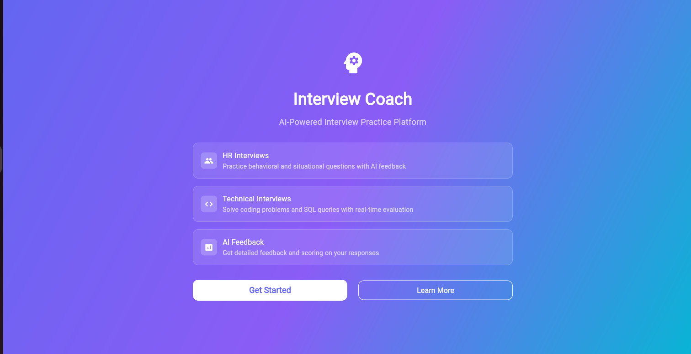
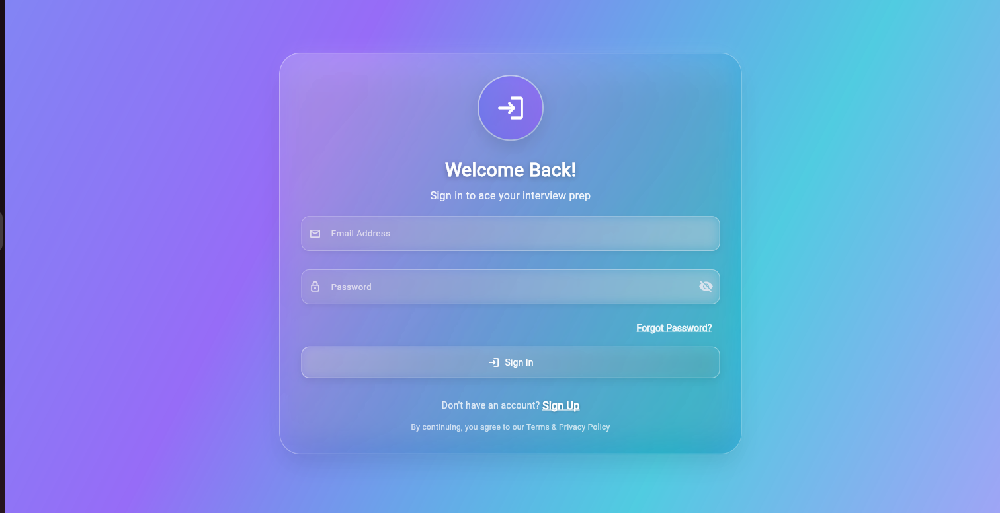
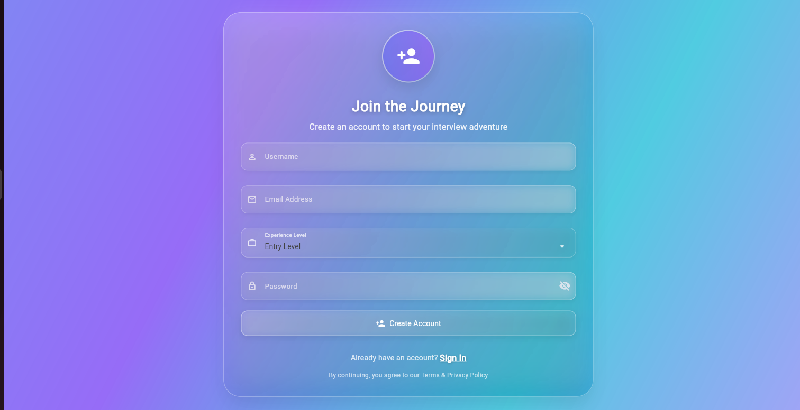
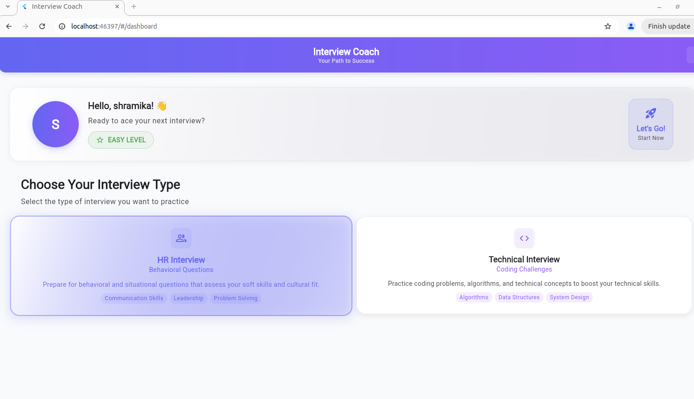
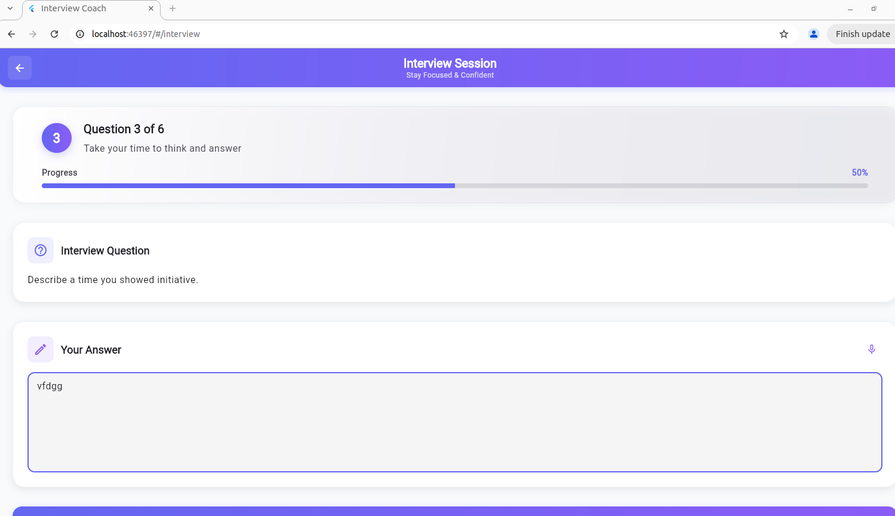
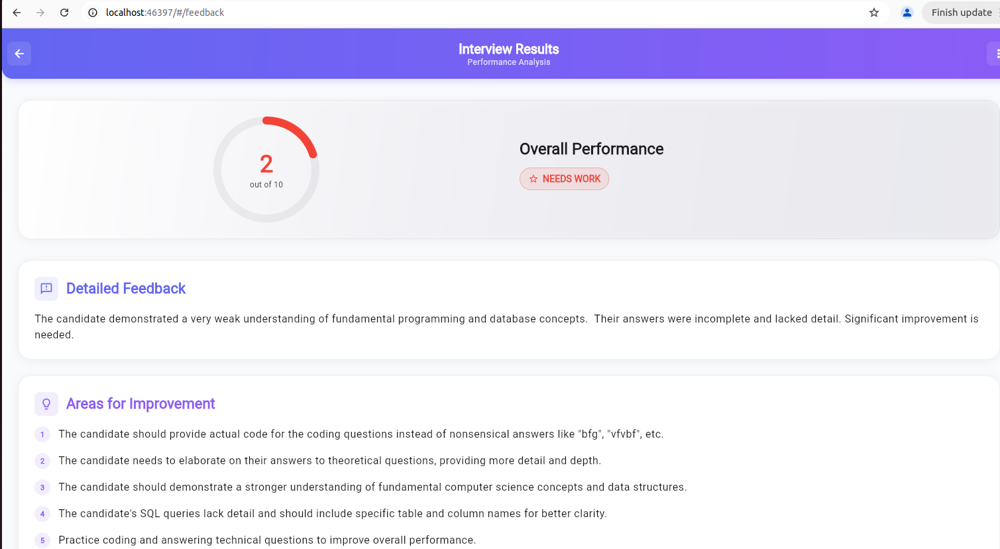
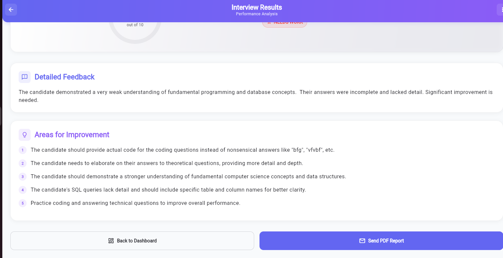
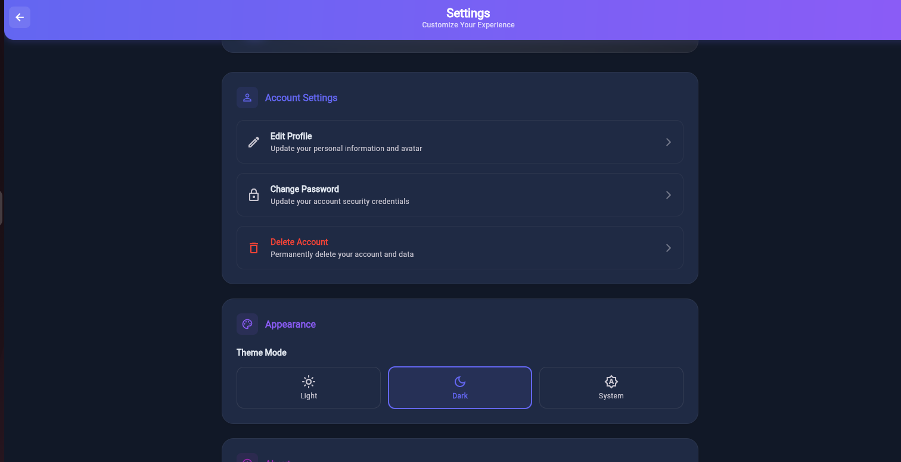

# HR Interview System

A production-ready HR interview system built with Python (FastAPI + LangGraph + SQLAlchemy) backend and Flutter frontend.

## screens


## 📱 Screens

### 1. Landing Screen
# Interview AI Powered App

An AI-powered interview preparation app with Flutter (UI) and FastAPI (Backend).

## 🚀 Features
- AI-driven interview sessions (HR & Technical)
- Feedback after completion
- Dark mode support
- Responsive UI

---

## 📱 Screenshots

### 1. Landing Screen


### 2. Login/Register Screen
  


### 3. Dashboard Screen
  


### 4. Interview Screen


### 5. Result Screen
  


### 6. Settings Screen
  


---

## ⚡️ Tech Stack
- **Frontend (UI)** → Flutter (Bloc, Responsive UI)
- **Backend** → FastAPI + LangGraph + SQLAlchemy
- **AI** → Gemini (via LangChain)
- **Database** → SQLite

---

## 🛠️ Setup

### Clone the repo
```bash
git clone https://github.com/Shramikachavda/interview_app.git
cd interview_app


## 🚀 Features

### Backend
- **Modular LangGraph Workflow**: Complete interview flow with session management
- **Question Mix**: 60% from database, 40% from Gemini LLM
- **Duplicate Prevention**: Ensures no duplicate questions per session
- **Session Persistence**: Full session state management in database
- **Structured Feedback**: AI-generated feedback after interview completion
- **Production-Ready**: Error handling, validation, and modular architecture

### Frontend
- **Real-time Question Flow**: One question at a time with smooth transitions
- **Progress Tracking**: Visual progress bar and question counter
- **API Integration**: Real HTTP client for backend communication
- **BLoC Pattern**: Clean state management with proper error handling
- **Responsive UI**: Modern, user-friendly interface
- 


## 🚀 Getting Started

### Backend Setup
```bash
cd interview_backend
pip install -r requirements.txt
uvicorn main:app --reload
```

### Frontend Setup
```bash
cd inteview_ui
flutter pub get
flutter run
```

## 🔧 Configuration

### Backend Settings (`core/config.py`)
- `min_questions_per_session`: Minimum questions per interview
- `max_questions_per_session`: Maximum questions per interview
- `llm_probability`: Probability of using LLM vs database (default: 0.4)

### Frontend Settings (`netwrok/api_client.dart`)
- `baseUrl`: Backend API URL (default: `http://localhost:8000/api`)

