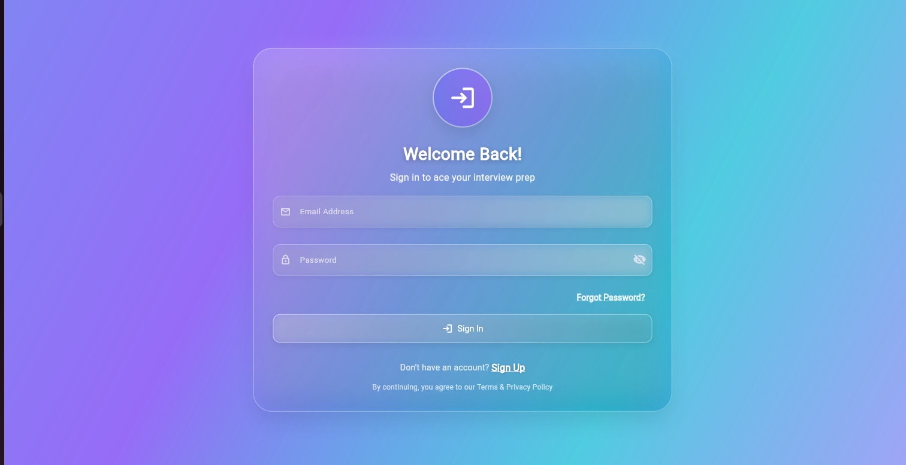
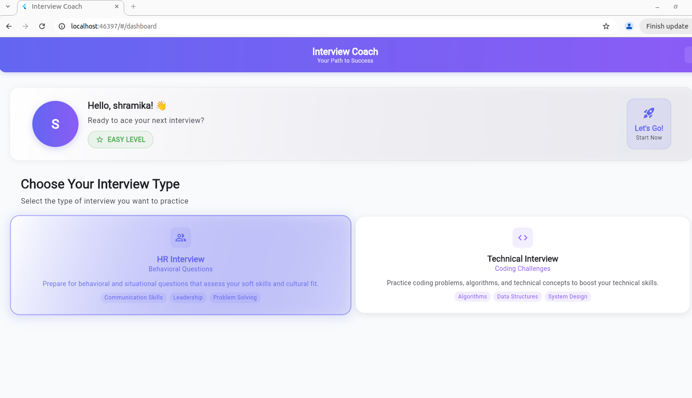
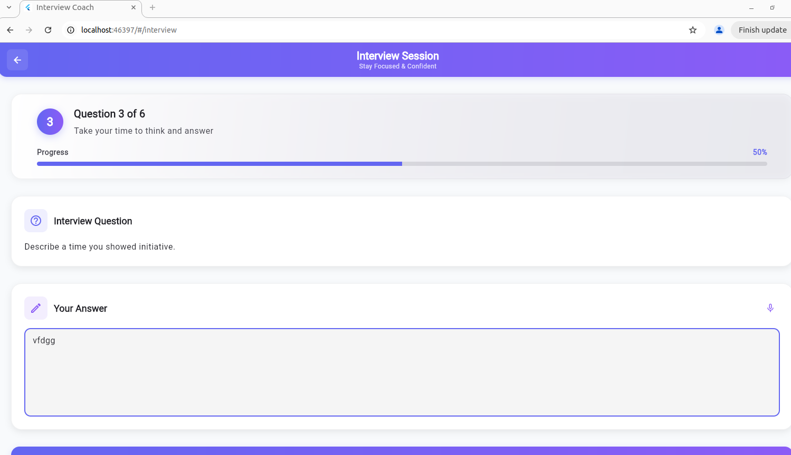
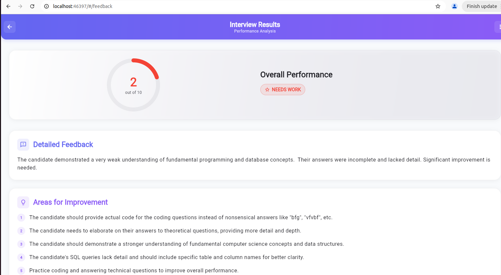
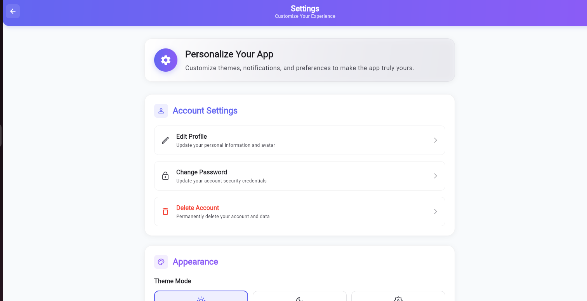
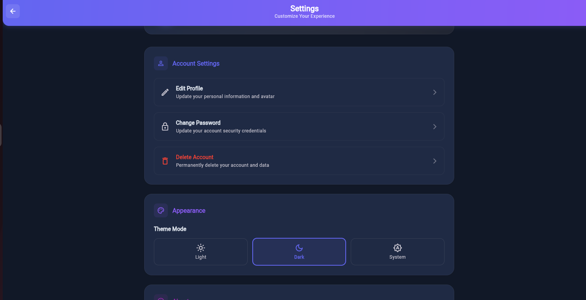

# Interview Coach - AI-Powered Interview Practice Platform

A comprehensive Flutter application for practicing HR and Technical interviews with AI-powered feedback and analysis.

## 🚀 Features

### Core Features
- **HR Interview Practice**: Behavioral and situational questions
- **Technical Interview Practice**: Coding problems and technical questions
- **AI-Powered Feedback**: Intelligent analysis of interview responses
- **Progress Tracking**: Monitor your interview performance over time
- **Theme Support**: Light, Dark, and System theme modes
- **Responsive Design**: Works seamlessly across mobile, tablet, and desktop

### Technical Features
- **BLoC Pattern**: Clean state management using flutter_bloc
- **Modular Architecture**: Well-organized folder structure
- **Theme Management**: Persistent theme preferences
- **Form Validation**: Comprehensive input validation
- **Error Handling**: Graceful error management
- **Loading States**: Smooth loading indicators

## 📱 Screens

### 1. Landing Screen

### 2. Login/Register Screen

### 3. Dashboard Screen

### 4. Interview Screen

### 5. Result Screen

### 6. Settings Screen

### 1. Landing Screen
- Welcome message and app introduction
- "Get Started" button to begin

### 2. Login/Register Screen
- Email and password authentication
- Form validation
- Experience level selection
- Smooth animations

### 3. Dashboard Screen
- Welcome section with user info
- Interview type selection (HR/Technical)
- Quick access to settings

### 4. Interview Screen
- Question-by-question navigation
- Progress tracking
- Auto-save answers

### 5. Result Screen
- Performance score visualization
- AI feedback analysis
- Areas for improvement
- Retake interview option

### 7. Settings Screen
- Theme selection (Light/Dark/System)
- Account management
- App information
- Privacy settings
- change password

### State Management
- **AuthBloc**: Handles authentication state
- **InterviewBloc**: Manages interview sessions and questions
- **ThemeCubit**: Controls theme preferences
- **DashboardBloc**: Manages dashboard data

## 📄 License
This project is licensed under the MIT License - see the LICENSE file for details.
---
**Built with ❤️ using Flutter**

